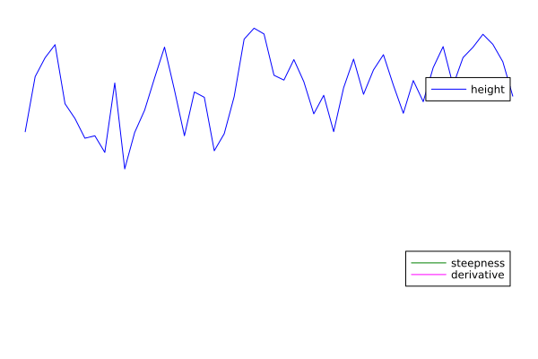

# BYU Scientific Computing Course Example C++

This repository contains code that parallels what students need to create for the [BYU Scientific Computing Course's semester-long project](https://byuhpc.github.io/sci-comp-course/project/overview.html). [The problem](#the-problem-orogeny), of course, is different, but mirroring the structure and style shown here will serve students well.


## Download and Install

Make sure to clone the repository with submodules:

```bash
git clone --recursive git@github.com:BYUHPC/sci-comp-course-example-cxx.git
```

Alternately, you can initialize and update submodules after cloning:

```bash
git submodule init
git submodule update
```

To build and test, set `srcdir` to the directory containing `CMakeLists.txt`, navigate to a clean build directory, and run:

```bash
cmake "$srcdir"
cmake --build . --parallel
ctest
```

The binaries `initial`, `mountaindiff` and `solver_*` will be built.


## Usage

`mountaindiff` is used to check whether two [binary mountain range files](#io-format) are similar enough to be considered identical; run `mountaindiff --help` for its usage.

The other binaries mirror those that will be built for the C++ phases of the project:

| Corresponding Phase | Binary | Source files |
| --- | --- | --- |
| [Phase 1](https://byuhpc.github.io/sci-comp-course/project/phase1) | `initial` | [initial](src/initial.cpp), [MtnRngSM](src/MountainRangeSharedMem.hpp), [MtnRngOMP](src/MountainRangeOpenMP.hpp) |
| [Phase 2](https://byuhpc.github.io/sci-comp-course/project/phase2) | `solver_serial`* | [solver_openmp](src/solver_openmp.cpp), [MtnRngSM](src/MountainRangeSharedMem.hpp), [MtnRngOMP](src/MountainRangeOpenMP.hpp) |
| [Phase 3](https://byuhpc.github.io/sci-comp-course/project/phase3) | `solver_openmp` | [solver_openmp](src/solver_openmp.cpp), [MtnRngSM](src/MountainRangeSharedMem.hpp), [MtnRngOMP](src/MountainRangeOpenMP.hpp) |
| [Phase 5](https://byuhpc.github.io/sci-comp-course/project/phase5) | `solver_thread` | [solver_thread](src/solver_thread.cpp), [MtnRngSM](src/MountainRangeSharedMem.hpp), [MtnRngThrd](src/MountainRangeThreaded.hpp), [CLTP](CoordinatedLoopingThreadpoolCXX/CoordinatedLoopingThreadpool.hpp) |
| [Phase 7](https://byuhpc.github.io/sci-comp-course/project/phase7) | `solver_mpi`* | [solver_mpi](src/solver_mpi.cpp), [MtnRngMPI](src/MountainRangeMPI.hpp) |
| [Phase 8](https://byuhpc.github.io/sci-comp-course/project/phase8) | `solver_gpu`* | [solver_gpu](src/solver_gpu.cpp), [MtnRngSM](src/MountainRangeSharedMem.hpp), [MtnRngGPU](src/MountainRangeGPU.hpp) |

In addition to the source files listed above, each binary depends on [MtnRng](src/MountainRange.hpp), and each `solver_*` depends on [binary_io](simple-cxx-binary-io/binary_io.hpp) and [run_solver](src/run_solver.hpp).

\* `solver_serial` uses identical code to `solver_openmp`, but is compiled without OpenMP--part of the beauty of OpenMP. `solver_mpi` is only built if an MPI compiler is found. `solver_gpu` is only built if the compiler is [Nvidia's HPC SDK](https://developer.nvidia.com/hpc-sdk).

Each generated `solver_*` has a help message explaining its usage; use `<binary-name> --help` to print it.


## The Problem: Orogeny

This example code simulates a crude approximation of [mountain building](https://en.wikipedia.org/wiki/Orogeny) with a [Neumann boundary condition](https://en.wikipedia.org/wiki/Neumann_boundary_condition) in one dimension:



As with the [problem this one parallels](https://byuhpc.github.io/sci-comp-course/project/overview#setup), simplifications are made to reduce code complexity. The state is fully determined by:

- `t`: the amount of time that the simulation has progressed. Given a time step `dt`, this is the amount of iterations multiplied by `dt`, which [like in the parallel problem](https://byuhpc.github.io/sci-comp-course/project/overview.html#setup) is fixed at 0.01.
- `r`: an array in which each cell represents the **uplift rate** at the corresponding point.
- `h`: an array in which each cell represents the current **height** of the correspondint point.
- `g`: an array in which each cell represents the current **growth rate** of the corresponding point.

This state will hence be referred to as a **mountain range**.


## Advancing the Simulation

To **step** the `i`th cell of a mountain range from time `t` to time `t+dt` the following algorithm is used:

$$L_i^{(t)} = \frac{h_{left}^{(t)} + h_{right}^{(t)}}{2} - h_i^{(t)}$$

$$g_i^{(t+dt)} = r_i - \left(h_i^{(t)}\right)^3 + L_i^{(t)}$$

$$h_i^{(t+dt)} = h_i^{(t)} + dt \space g_i^{(t+1)}$$

...where $left$ and $right$ are normally $i-1$ and $i+1$ respectively, but are $i$ at the edge of the array where $i-1$ or $i+1$ would exceed the array's bounds; this fulfills the zero-derivative boundary condition of the simulation.

Here's how one step of `dt` for the whole mountain range might look in Julia:

```julia
function step!(h, g, r, dt)
    # Update g
    for i in eachindex(r, h, g)
        left  = min(i-1, firstindex(r, 1))
        right = max(i+1,  lastindex(r, 1))
        L = (h[left]+h[right])/2 - h[i]
        g[i] = r[i]-h[i]^3+L
    end
    # Update h
    for i in eachindex(r, h, g)
        h[i] += dt*g[i]
    end
end
```


## Stopping Criterion: Steepness Derivative

We discretize the derivative of the mountain range's ["steepness"](#steepness-and-its-derivative) at cell $i$ as:

$$\dot{s}_i = \frac{\left( h_{right} - h_{left} \right)\left( g_{right} - g_{left} \right)}{2 n}$$

...where $left$ and $right$ are defined as [above](#advancing-the-simulation), and $n$ is the number of cells in the `h` and `g` arrays.

The simulation stops when the sum of the steepness derivative over the whole mountain range falls below zero--i.e. when the range is at its "steepest."

The **steepness derivative** of a mountain range could be calculated in Julia thus:

```julia
function dsteepness(h, g)
    ds = 0
    for i in eachindex(h, g)
        left  = min(i-1, firstindex(h))
        right = max(i+1,  lastindex(h))
        ds += (h[right]-h[left]) * (g[right]-g[left]) / 2
    end
    return ds/length(h)
end
```


## Running the Simulation

The purpose of this code is to, given an initial state, update that state until the steepness derivative drops below zero (i.e. **solve** the state). Given initial state given by uplift rate `r`, time step `dt`, simulation time `t0`, height `h0`, and growth rate `g0`, and the functions [`step!`](#advancing-the-simulation) and [`dsteepness`](#stopping-criterion-steepness-derivative) defined above, here is a Julia function that would solve the state:

```julia
function solve(t0, h0, g0, r, dt)
    # Initialize
    t = t0
    h, g = deepcopy.(h0, g0)
    # Solve
    while dsteepness(h, g) >= 0
        step!(h, g, r, dt)
        t += dt
    end
    # Return updated state as a tuple
    return h, g, t
end
```

`initial` simply creates a mountain range, solves it, and prints the resulting simulation time. `solver_*` read files containing [binary mountain ranges](#io-format), solve them, and write the solved mountain ranges in the same format. There are several sample input and output files in the [samples directory](samples) that are meant to be used for validation; as an example, one could check that `solver_thread` works as expected with four threads thus:

```bash
SOLVER_NUM_THREADS=4 build-dir/solver_thread samples/small-1D-in.mr /tmp/my-small-1D-out.mr
build-dir/mountaindiff samples/small-1D-out.mr /tmp/my-small-1D-out.mr \
        && echo Success \
        || echo Failure
```


## I/O Format

Mountain range data files contain binary data sufficient to represent the [state](#the-problem-orogeny) of the simulation. Here is the order and format of the elements in a mountain range file:

| | Member | Format |
| --- | --- | --- |
| 1 | Number of dimensions (always 1 in our case) | 64-bit unsigned integer |
| 2 | Number of elements in each array (`n`) | 64-bit unsigned interger |
| 3 | Simulation time | 64-bit float |
| 4 | Uplift rate array | `n` 64-bit floats |
| 5 | Height array | `n` 64-bit floats |

The data is tightly packed--there are no gaps between elements.

See the `write` function in [`src/MountainRangeSharedMem.hpp`](src/MountainRangeSharedMem.hpp) for an example of how to write in binary.


## Appendix A: Mathematical Justification

As with the [project problem](https://byuhpc.github.io/sci-comp-course/project/overview.html#appendix-c-mathematical-justification), you don't need to understand the following, but it's included for context.

The differential equation governing the evolution of the simulation is:

$$\dot h = r - h^3 + \nabla^2 h$$

...where $h$ is the height, $\dot{h}$ is its time derivative (the growth rate), $r$ is the rate of uplift (a constant), and $\nabla^2 h$ is the [Laplacian](https://en.wikipedia.org/wiki/Laplace_operator) of the height.

Again like the project problem, this can be generalized to an arbitrary number of dimensions, but we stick to one dimension here for simplicity.

### Boundary Condition

The derivative at the edges is simulated as zero by treating the cells just beyond the edge of the array as being of identical value to the corresponding edge cells.

### Steepness and its Derivative

We define the steepness to be the average squared 2-norm of the gradient of the height across the mountain range:

$$s = \frac{1}{X} \int_M \left\Vert \nabla h \right\Vert_2^2 dx$$

...where $X$ is the length of the mountain range.

The [derivative of the steepness with respect to time](#time-derivative-of-euclidean-norm-of-gradient) is:

$$\dot s = \frac{2}{X} \int_M \nabla h \cdot \nabla \dot h \space dx$$

The simulation stops when $\dot s$ drops below zero--i.e. when the mountain range is at its "steepest."

### Gradient

The gradient is discretized as:

$$\nabla x_{i,j,...} \approx \left(\frac{x_{i+1,j,...}-{x_{i-1,j,...}}}{2}, \frac{x_{i,j+1,...}-{x_{i,j-1,...}}}{2}, ... \right)$$

...which in one dimension becomes:

$$\nabla x_i = \frac{x_{i+1} - x_{i-1}}{2}$$

### Time Derivative of Euclidean Norm of Gradient

The derivative of the two-norm of the gradient of $v$ with respect to time is the sum of the time derivatives of the squared spatial derivatives of $v$:

$$\frac{\partial}{\partial t} \left\Vert \nabla v \right\Vert_2^2 = \sum_n^N \frac{\partial}{\partial t} \left( \frac{\partial v}{\partial v_n} \right)^2$$

...where each of $v_n$ are the elements of $N$-dimensional $v$. By the chain rule this becomes:

$$\sum_n^N \frac{\partial}{\partial t} v_n^2 = \sum_n^N 2 \frac{\partial v}{\partial v_n} \frac{\partial\dot v}{\partial v_n}$$

...where $\dot v$ represents the derivative of $v$ with respect to time. This can be simplified to:

$$\frac{\partial}{\partial t} \left\Vert \nabla v \right\Vert_2^2 = 2 \nabla v \cdot \nabla \dot v$$
