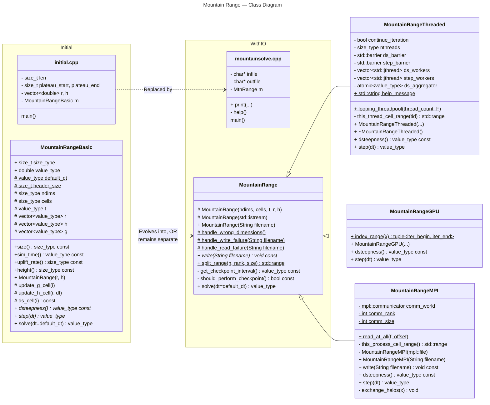

# Mountain Range — Class Diagram

> [!IMPORTANT]
> This diagram relies on [Mermaid diagrams](https://mermaid.js.org/) which displays properly when rendered within GitHub.
>
> It may not work properly when rendered within other websites. [Click here to view the source](https://github.com/BYUHPC/sci-comp-course-example-cxx/blob/main/docs/MountainRange-class-diagram.md).

## Intro

This [class diagram](https://mermaid.js.org/syntax/classDiagram.html#class-diagrams) written with Mermaid visually represents
the relationships between classes which offer multiple computational approaches to the `MountainRange`.

It is designed to emphasize the role of **inheritance** in sharing/overriding code
from the base class as much as possible while sub-classes provide _only_ the new
functionality associated with its particular objective.

The code covered by this diagram exists in five separate example files:
* [initial.cpp](../src/initial.cpp) (driver code | initial)
* [MountainRangeBasic.hpp](../src/MountainRangeBasic.hpp) (simple class | initial)
* [mountainsolve.cpp](../src/mountainsolve.cpp) (driver code)
* [MountainRange.hpp](../src/MountainRange.hpp) (base class)
* [MountainRangeThreaded.hpp](../src/MountainRangeThreaded.hpp) (sub-class)
* [MountainRangeMPI.hpp](../src/MountainRangeMPI.hpp) (sub-class)
* [MountainRangeGPU.hpp](../src/MountainRangeGPU.hpp) (sub-class)

## Videos

- 🎥 [MountainRange — Class Diagram](https://www.loom.com/share/8280654f78754a16902ecd3c9b2c9128?sid=5c193f4c-ae6f-49bb-9c9f-914db2833183)
- 🎥 [MountainRange — Code Walkthrough](https://www.loom.com/share/2e5242942ca74d17b85ce05f97138e60?sid=3d91e827-d55a-44d4-bfc8-58adff1cbac5)

## Inheritance

Inheritance allows a base class to define common functionality that multiple specialized sub-classes can extend or override as needed. This approach reduces code duplication and makes it easier to experiment with different computational methods while maintaining a consistent interface.

See these resources to learn more about inheritance:
* [Inheritance in C++ | GeeksForGeeks](https://www.geeksforgeeks.org/inheritance-in-c/)
* [Inheritance in C++ | Simplilearn](https://www.simplilearn.com/tutorials/cpp-tutorial/types-of-inheritance-in-cpp)
* [Virtual functions | IBM](https://www.ibm.com/docs/en/zos/3.1.0?topic=only-virtual-functions-c)
* [C++ Virtual Functions and Function Overriding | Programiz](https://www.programiz.com/cpp-programming/virtual-functions)

## Legend

| Item | Meaning |
| :-----: | :------------- |
| `+` | **Public** visibility (access modifier) |
| `#` | **Protected** visibility (access modifier) |
| `-` | **Private** visibility (access modifier) |
| <ins>underline</ins> | `static` method/attribute |
| <i>italics</u> | `virtual` method that can be overwritten  _Note: This is a deviation from standard UML  which uses underline to signal `abstract`._ |
| `const` | Methods: Calling the function does not change the state of any attributes  Attributes: The value will never change after assignment |

## Diagram

