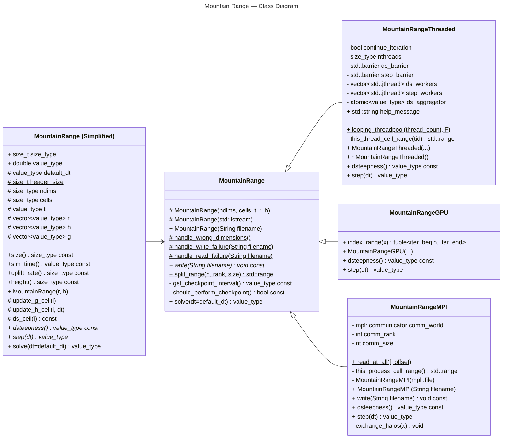

# Mountain Range — Class Diagram

## Legend

| Item | Meaning |
| :-----: | :------------- |
| `+` | **Public** visibility (access modifier) |
| `#` | **Protected** visibility (access modifier) |
| `-` | **Private** visibility (access modifier) |
| <ins>underline</ins> | `static` method/attribute |
| <i>italics</u> | `virtual` method that can be overwritten  _Note: This is a deviation from standard UML  which uses underline to signal `abstract`._ |
| `const` | Methods: Calling the function does not change the state of any attributes  Attributes: The value will never change after assignment |

## Diagram

