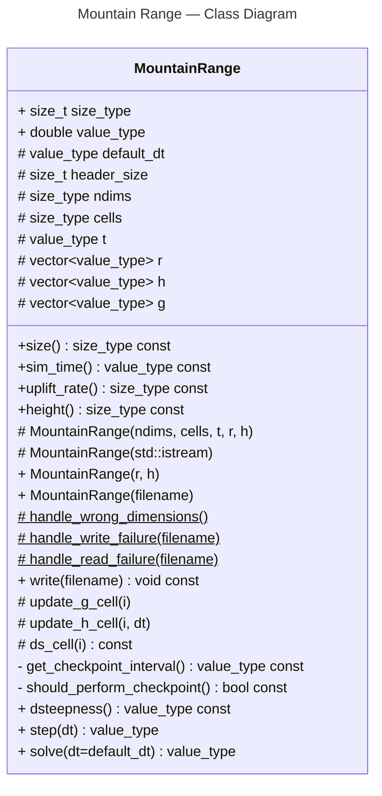

# Mountain Range — Class Diagram

```mermaid
---
title: Mountain Range — Class Diagram
---
classDiagram

class MountainRange {
    %% Global type variables (readability + mutability)
    + size_t size_type
    + double value_type

    %% Data storage parameters
    # value_type default_dt
    # size_t header_size
    # size_type ndims
    # size_type cells
    # value_type t
    # vector~value_type~ r
    # vector~value_type~ h
    # vector~value_type~ g

    %% Getter methods
    +size() size_type const
    +sim_time() value_type const
    +uplift_rate() size_type const
    +height() size_type const

    %% Constructors
    # MountainRange(ndims, cells, t, r, h)
    # MountainRange(std::istream)
    + MountainRange(r, h)
    + MountainRange(filename)

    %% Error handling
    # handle_wrong_dimensions()$
    # handle_write_failure(filename)$
    # handle_read_failure(filename)$

    %% Output
    + write(filename) void const

    %% Solving
    # update_g_cell(i)
    # update_h_cell(i, dt)
    # ds_cell(i) const

    - get_checkpoint_interval() value_type const
    - should_perform_checkpoint() bool const

    + dsteepness() value_type const
    + step(dt) value_type
    + solve(dt=default_dt) value_type
}
```
