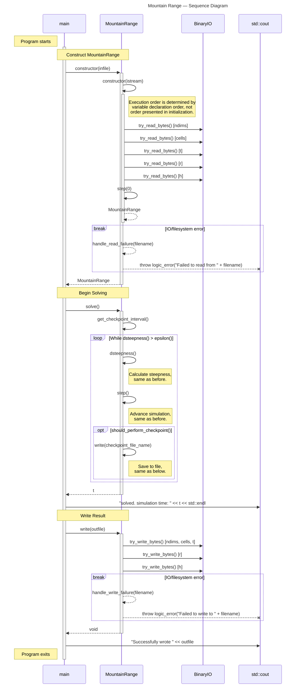

# Mountain Range — Sequence Diagram

> [!IMPORTANT]
> This diagram relies on [Mermaid diagrams](https://mermaid.js.org/) which display properly when rendered within GitHub.
>
> It may not work properly when rendered within other websites. [Click here to view the source](https://github.com/BYUHPC/sci-comp-course-example-cxx/blob/main/docs/MountainRange-sequence-diagram.md).

## Intro

This [sequence diagram](https://mermaid.js.org/syntax/sequenceDiagram.html#sequence-diagrams) written with Mermaid visually represents the calls and work being performed in the `MountainRange` example.

It is designed to help visualize the new behaviors required in Phase 2 relating to file IO and checkpointing.
While this diagram merely illustrates the difference, the code may evolve to hold all the code in a single file, or separate the concerns into two separate files.
Compare against the [MountainRangeBasic sequence diagram](./MountainRangeBasic-sequence-diagram.md).

The code covered by this diagram exists in two separate example files:
* [MountainRange.hpp](../src/MountainRange.hpp) (base class)
* [mountainsolve.cpp](../src/mountainsolve.cpp) (driver code)

## Videos

- 🎥 [MountainRange — Sequence Diagram](https://www.loom.com/share/32bde27b238b4ae6a75966cc435b6c0d?sid=38cb3a9f-3478-4e73-9791-5b1e2a31339d)
- 🎥 [MountainRange — Code Walkthrough](https://www.loom.com/share/6542261b640e40efb2cf7f6be695f4b2?sid=71dbc02f-4c0b-46b0-be59-8685ce13cce0)

## Diagram

