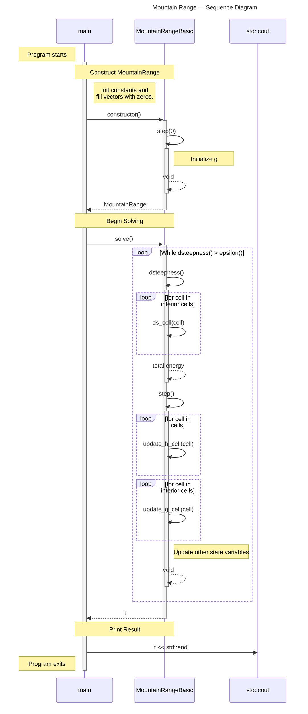

# Mountain Range Basic — Sequence Diagram

> [!IMPORTANT]
> This diagram relies on [Mermaid diagrams](https://mermaid.js.org/) which display properly when rendered within GitHub.
>
> It may not work properly when rendered within other websites. [Click here to view the source](https://github.com/BYUHPC/sci-comp-course-example-cxx/blob/main/docs/MountainRangeBasic-sequence-diagram.md).

## Intro

This [sequence diagram](https://mermaid.js.org/syntax/sequenceDiagram.html#sequence-diagrams) written with Mermaid visually represents the calls and work being performed in the `MountainRange` example.

It is designed to help visualize the relationships between the various entities involved in running the program.

The code covered by this diagram exists in two separate example files:
* [MountainRangeBasic.hpp](../src/MountainRangeBasic.hpp) (base class)
* [initial.cpp](../src/initial.cpp) (driver code)

## Diagram

