# Mountain Range MPI — Sequence Diagram

> [!IMPORTANT]
> This diagram relies on [Mermaid diagrams](https://mermaid.js.org/) which display properly when rendered within GitHub.
>
> It may not work properly when rendered within other websites. [Click here to view the source](https://github.com/BYUHPC/sci-comp-course-example-cxx/blob/main/docs/MountainRangeMPI-sequence-diagram.md).

## Intro

This [sequence diagram](https://mermaid.js.org/syntax/sequenceDiagram.html#sequence-diagrams) written with Mermaid visually represents
the calls and work being performed in the `MountainRangeMPI` example.

It is designed to help visualize the new model of computation as work is divided among multiple independent processes on multiples nodes to computer in parallel.
The logical coordination between each of the processes is illustrated, but the exact distribution of responsibilities between each process is not illustrated.
Operations already defined in the base `MountainRange` class are simplified or omitted in this diagram.

The code covered by this diagram exists in three separate example files:
* [MountainRangeMPI.hpp](../src/MountainRangeMPI.hpp) (sub-class)
* [MountainRange.hpp](../src/MountainRange.hpp) (base class)
* [mountainsolve.cpp](../src/mountainsolve.cpp) (driver code)

## Videos

- 🎥 [MountainRange MPI — Sequence Diagram]()
- 🎥 [MountainRange MPI — Code Walkthrough]()

## Diagram

```mermaid
---
title: Mountain Range MPI — Sequence Diagram
---

sequenceDiagram

participant main
participant MR as MountainRange (Example)

%% box Orange Node1
%% participant MR1 as MountainRange1
%% participant MR2 as MountainRanges 2...4
%% end
%% box Yellow Node2
%% participant MR5 as MountainRange5
%% participant MR6 as MountainRanges 6...8
%% end



participant file as MPL::file

note left of main: Program starts
activate main

%% Construct MountainRange
note over main,MR: Construct MountainRanges
note over MR,MR6: Each process reads the entire header and its assigned cells
main->>+MR: constructor(char *filename)
    note over file: Open file for reading only
    MR->>+file: mpl::file(comm_world, filename, read_only)
    MR->>+MR: constructor(mpl::file &&f)

        MR->>file: read_at_all() [ndims]
        MR->>file: read_at_all() [cells]
        MR->>file: read_at_all() [t]

        note right of MR: Call parent constructor<br> with minimal r and h vectors. <br>They will be resized later.
        MR->>MR: MountainRange(ndims, cells, t, 3, 3)

        note right of MR: Determine responsible cell ranges. <br>Expand to include halo cells.
        MR->>MR: this_process_cell_range()

        note right of MR: Resize data vectors. <br>Read in only the cells that will be <br>needed by this process.
        MR->>file: read_at(r_offset, r.data(), layout) [r]
        MR->>file: read_at(h_offset, h.data(), layout) [h]

        MR->>MR: step(0)

    MR-->>-MR: MountainRangeMPI

    MR --x file: «passes out of scope»
    deactivate file
    note over file: File is closed

    break mpl::io_failure is thrown
        MR->>MR: handle_read_failure(filename)
    end

MR-->>-main: MountainRangeMPI
%% End construct MountainRange

%% Call Solve
note over main,MR: Begin Solving
main->>+MR: solve()

    %% Prepare for checkpointing
    MR->>MR: get_checkpoint_interval()

    %% Begin solve loop
    loop Until steepness < epsilon()

        %% Evaluate steepness
        MR->>+MR: dsteepness()
        MR-->>-MR: ds_aggregator
        %% End steepness calculation

        %% Perform step
        MR->>+MR: step()
        MR-->>-MR: void
        %% End step

        %% Checkpoint
        MR->>MR: checkpoint()
        note right of MR: Base code performs <br>checkpointing.

    end
    %% End solve loop

MR-->>-main: t
%% End solve

%% Call Write
note over main,MR: Write Result
note over MR,MR6: Each process writes the entire header and its assigned cells
main->>+MR: write()

    note over file: Open file for creating & writing only
    MR->>+file: mpl::file(comm_world, filename, create|write_only)

    MR->>file: write_all(ndims)
    MR->>file: write_all(cells)
    MR->>file: write_all(t)

    note right of MR: Determine where in the file our cells belong
    MR->>MR: this_process_cell_range()

    MR->>file: write_at(r_offset, r.data()+halo_offset, layout)
    MR->>file: write_at(h_offset, h.data()+halo_offset, layout)

    MR --x file: «passes out of scope»
    deactivate file
    note over file: File is closed

    break mpl::io_failure is thrown
        MR->>MR: handle_write_failure(filename)
    end

MR-->>-main: void
%% End write

%% Destruct MountainRange
note over main,MR: Destruct MountainRange
main--x+MR: ~MountainRange()

MR-->>-main: void
destroy MR
%% End destruct MountainRange

note left of main: Program exits
deactivate main
```

