# Mountain Range Threaded — Sequence Diagram

> [!IMPORTANT]
> This diagram relies on [Mermaid diagrams](https://mermaid.js.org/) which display properly when rendered within GitHub.
>
> It may not work properly when rendered within other websites. [Click here to view the source](https://github.com/BYUHPC/sci-comp-course-example-cxx/blob/main/docs/MountainRangeThreaded-sequence-diagram.md).

## Intro

This [sequence diagram](https://mermaid.js.org/syntax/sequenceDiagram.html#sequence-diagrams) written with Mermaid visually represents
the calls and work being performed in the `MountainRangeThreaded` example.

It is designed to help visualize the new model of computation as work is divided among worker threads to occur in parallel.
The details of thread creation, lifespan, and destruction have been carefully illustrated.
Operations already defined in the base `MountainRange` class are simplified or omitted in this diagram.

The code covered by this diagram exists in three separate example files:
* [MountainRangeThreaded.hpp](../src/MountainRangeThreaded.hpp) (sub-class)
* [MountainRange.hpp](../src/MountainRange.hpp) (base class)
* [mountainsolve.cpp](../src/mountainsolve.cpp) (driver code)

## Videos

- 🎥 [MountainRange Threaded — Sequence Diagram](https://www.loom.com/share/ad240327395f4ef68f75c9c32c50c835?sid=ef2cc2f0-1db8-4e69-9495-c2baa981a82a)
- 🎥 [MountainRange Threaded — Code Walkthrough](https://www.loom.com/share/021c71412297432db68243200bea0039?sid=df34de3b-7386-45df-8fee-a427d7dfd2f6)

## Diagram

```mermaid
---
title: Mountain Range Threaded — Sequence Diagram
---

sequenceDiagram

participant main
participant MR as MountainRange

note left of main: Program starts
activate main

%% Construct MountainRange
note over main,MR: Construct MountainRange
main->>+MR: constructor()

    note right of MR: Call parent constructor. <br> Read data from file.

    %% Create dw workers
    MR->>+MR: looping_threadpool()
    create participant dw as ds_workers (x8)
    MR->>+dw: new jthread()
    dw->>+dw: F()
    dw->>dw: arrive_and_wait()
    MR-->>-MR: vector<jthread>
    %% End create dw workers

    %% Create sw workers
    MR->>+MR: looping_threadpool()
    create participant sw as step_workers (x8)
    MR->>+sw: new jthread()
    sw->>+sw: F()
    sw->>sw: arrive_and_wait()
    MR-->>-MR: vector<jthread>
    %% End create sw workers

MR-->>-main: MountainRangeThreaded
%% End construct MountainRange

%% Call Solve
note over main,MR: Begin Solving
main->>+MR: solve()

    %% Prepare for checkpointing
    MR->>MR: get_checkpoint_interval()

    %% Begin solve loop
    loop Until steepness < epsilon()

        %% Evaluate steepness
        MR->>+MR: dsteepness()
            MR->>MR: ds_aggregator = 0
            MR--)dw: arrive_and_wait()
            note over dw: Worker threads proceed<br>to do work and <br>store result in <br>`ds_aggregator`.
            MR<<-->>dw: arrive_and_wait()
            dw-->>-dw: true
            dw->>+dw: F()
            dw->>dw: arrive_and_wait()
        MR-->>-MR: ds_aggregator
        %% End steepness calculation

        %% Perform step
        MR->>+MR: step()
            MR--)sw: arrive_and_wait()
            note over sw: Worker threads proceed<br>to modify `h` cells.
            MR<<-->>sw: arrive_and_wait()
            note over sw: Worker threads proceed<br>to modify `g` cells.
            MR<<-->>sw: arrive_and_wait()
            sw-->>-sw: true
            sw->>+sw: F()
            sw->>sw: arrive_and_wait()
        MR-->>-MR: void
        %% End step

        %% Checkpoint
        MR->>MR: checkpoint()
        note right of MR: Base code performs <br>checkpointing.

        note over dw, sw: `while(F())` loop from looping_threadpool()<br>causes thread instances to be reused <br> between each computational iteration.

    end
    %% End solve loop

MR-->>-main: t
%% End solve

%% Call Write
note over main,MR: Write Result
main->>+MR: write()
note right of MR: Inherited method.<br>Write result to file.
MR-->>-main: void
%% End write

%% Destruct MountainRange
note over main,MR: Destruct MountainRange
main--x+MR: ~MountainRange()

    %% Destruct dw workers
    MR--)dw: arrive_and_wait()
    dw-->>-dw: false
    deactivate dw
    destroy dw
    MR--xdw: threads auto join and stop
    %% End destruct dw workers

    %% Destruct sw workers
    MR--)sw: arrive_and_wait()
    sw-->>-sw: false
    deactivate sw
    destroy sw
    MR--xsw: threads auto join and stop
    %% End destruct sw workers

MR-->>-main: void
destroy MR
%% End destruct MountainRange

note left of main: Program exits
deactivate main
```

