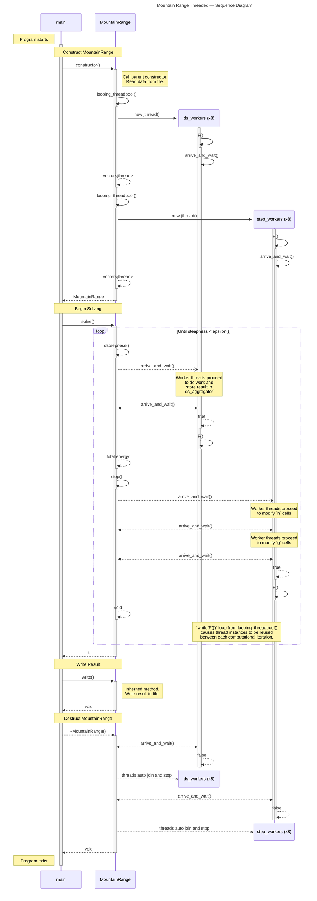

# Mountain Range Threaded — Sequence Diagram

> [!IMPORTANT]
> This diagram relies on [Mermaid diagrams](https://mermaid.js.org/) which display properly when rendered within GitHub.
>
> It may not work properly when rendered within other websites. [Click here to view the source](https://github.com/BYUHPC/sci-comp-course-example-cxx/blob/main/docs/MountainRangeThreaded-sequence-diagram.md).

## Intro

This [sequence diagram](https://mermaid.js.org/syntax/sequenceDiagram.html#sequence-diagrams) written with Mermaid visually represents
the calls and work being performed in the `MountainRangeThreaded` example.

It is designed to help visualize the relationships between
the various entities involved in running the program. The close reader will observe stacked activation functions representing calls
to methods on the base or subclass of the `MountainRange` object.

The code covered by this diagram exists in three separate example files:
* [MountainRangeThreaded.hpp](../src/MountainRangeThreaded.hpp) (sub-class)
* [MountainRange.hpp](../src/MountainRange.hpp) (base class)
* [mountainsolve.cpp](../src/mountainsolve.cpp) (driver code)

## Diagram

