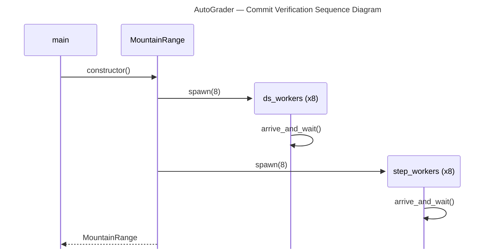

# Mountain Range Threaded — Sequence Diagram

```mermaid
---
title: AutoGrader — Commit Verification Sequence Diagram
config:
  mirrorActors: false
---

sequenceDiagram

participant main
participant MR as MountainRange

main->>MR: constructor()
create participant dw as ds_workers (x8)
MR->>dw: spawn(8)
dw->>dw: arrive_and_wait()
create participant sw as step_workers (x8)
MR->>sw: spawn(8)
sw->>sw: arrive_and_wait()
MR-->>main: MountainRange


```
